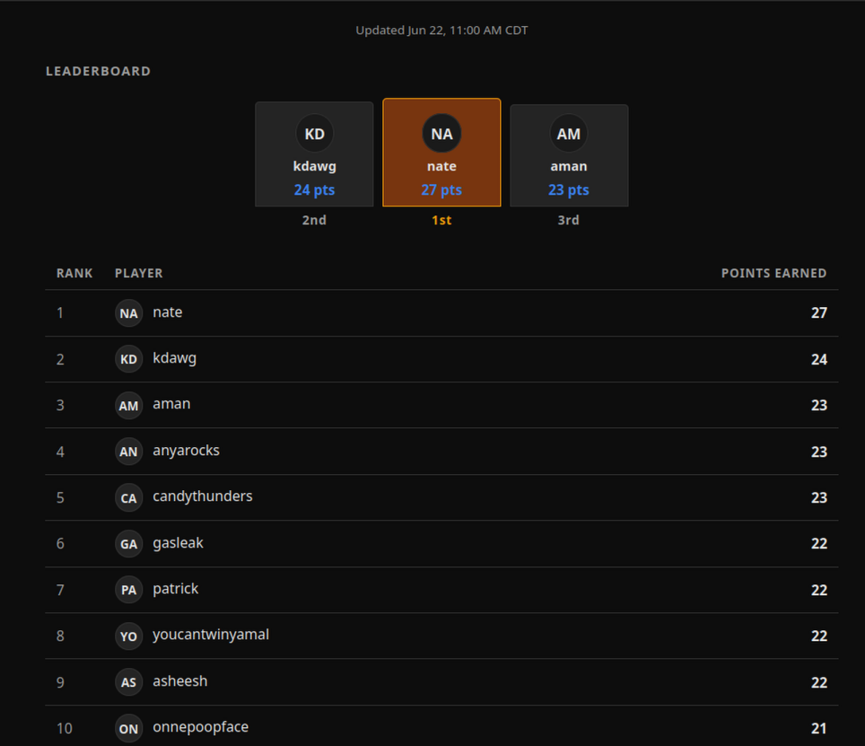
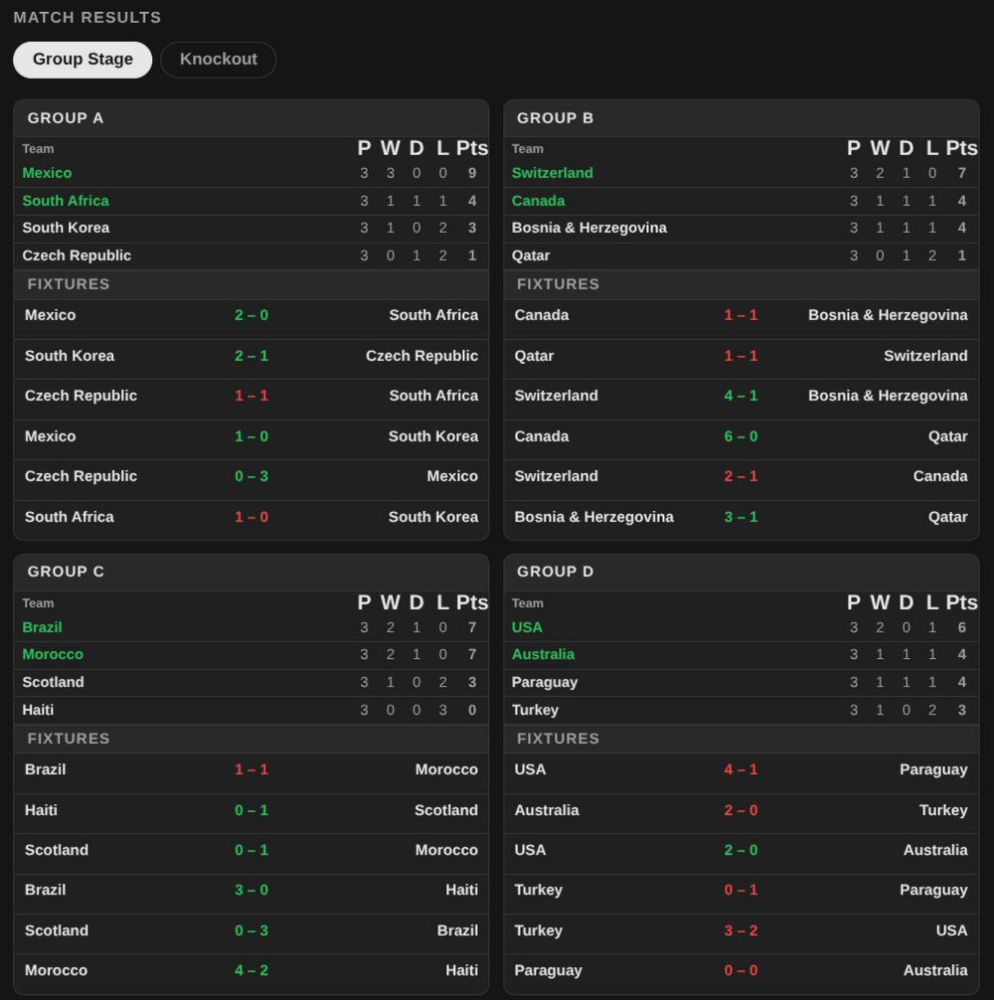

# World Cup 2026 Bracket League

Competitive bracket league for a group of friends. 

Live at: **[worldcup.amanahuja.me](https://worldcup.amanahuja.me)**

A lightweight prediction league for the FIFA World Cup 2026. Friends pay a small entry fee, receive login credentials, and submit predictions for this year's World Cup matches. Scores update automatically from live match data. Highest score at the end of the tournament wins the pot.

See [RULES.md](./RULES.md) for full scoring rules and how the tiebreaker works.

## Features

- Predict outcomes for all 104 matches — group stage, knockout rounds, and the third-place playoff
- Default predictions pre-populated from FIFA seedings — change any or all, or leave them as-is
- Live leaderboard updates hourly from match data
- Prediction overlays on results (logged-in users see correct/incorrect indicators per match)
- Official tiebreaker: guess the total goals scored in the Final. 
- Unofficial tiebreaker: other friends vote for who was the best heckler on our groupme chat

Privacy disclosure: See [RULES.md](./RULES.md), but, basically, everything is publicly visible here on github, and I had to use a cookie for the UI to work. 

## Data Sources for World Cup Results

- **[OpenLigaDB](https://api.openligadb.de)** — live match results, updated hourly via cron worker (`wm26` / `2026` league)
- **[openfootball/worldcup](https://github.com/openfootball/worldcup)** ([openfootball.github.io](https://openfootball.github.io/)) — reference fixture and results data

## Screenshots

<table>
  <tr>
    <td></td>
    <td></td>
  </tr>
  <tr>
    <td></td>
    <td></td>
  </tr>
</table>

## Tech Stack

- **Frontend:** Static HTML/CSS/JS on Cloudflare Pages
- **Backend:** Cloudflare Workers (auth, predictions, results, scoring)
- **Data:** YAML files in this repo, written by workers via GitHub Contents API
- **Auth:** HMAC-signed session cookies, credentials stored in Cloudflare KV

## This was vibe coded

I'm generally wary of vibe coding, but this project is actually a decent use case. 

It's a throwaway, one-time-use app. Maintainability doesn't matter — in four years the tech will have changed completely and I'll take a totally different approach for the next World Cup. The stakes are low: it's just me and some friends, so scale, downtime, and failure consequences aren't real concerns. And I had limited time, so vibe coding let me get it done essentially while on the move.

Having a clear spec in my head helped — being one of the target users made that easier.

**Process:** I used Claude.ai (browser) to work through the specs, do research, find data sources, and iterate on the design. Then I used [OpenCode](https://opencode.ai) as a coding agent to implement. The Cloudflare setup I did manually. Most of the vibe coding happened while doing house errands — except for UX iterations (requires actually looking at a screen) and some troubleshooting (same).

I always attempt to use local and less-powerful models, both to reduce costs and to reduce environmental impact. For this project I used Kimi k2.6 as a main model, and Claude Haiku 4.5 for the more complex tasks. 
